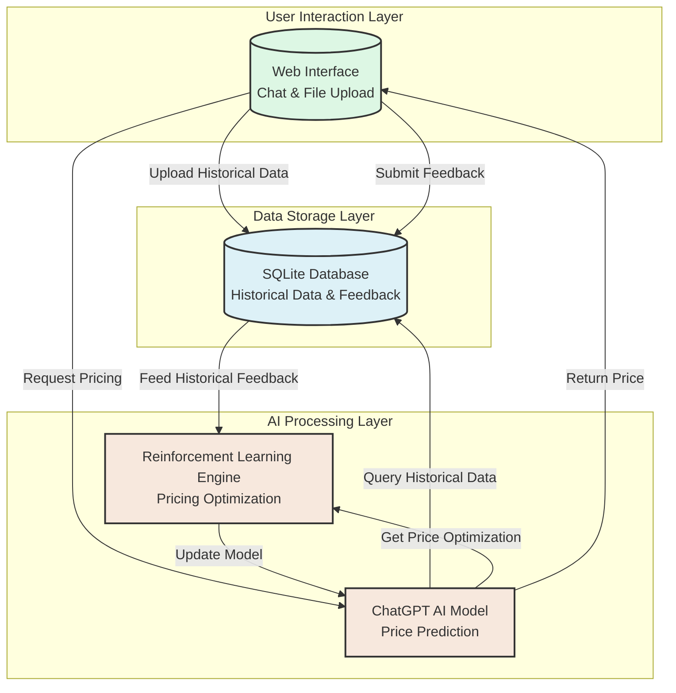

```mermaid
graph TB
    subgraph Frontend["User Interaction Layer"]
        UI[("Web Interface<br/>Chat & File Upload")]
    end

    subgraph Storage["Data Storage Layer"]
        DB[(SQLite Database<br/>Historical Data & Feedback)]
    end

    subgraph AI["AI Processing Layer"]
        GPT["ChatGPT AI Model<br/>Price Prediction"]
        RL["Reinforcement Learning Engine<br/>Pricing Optimization"]
    end

    UI -->|Upload Historical Data| DB
    UI -->|Request Pricing| GPT
    GPT -->|Query Historical Data| DB
    GPT -->|Get Price Optimization| RL
    RL -->|Update Model| GPT
    GPT -->|Return Price| UI
    UI -->|Submit Feedback| DB
    DB -->|Feed Historical Feedback| RL

    classDef default fill:#f9f9f9,stroke:#333,stroke-width:2px
    classDef storage fill:#ddf1f7,stroke:#333,stroke-width:2px
    classDef ai fill:#f7e8dd,stroke:#333,stroke-width:2px
    classDef frontend fill:#ddf7e4,stroke:#333,stroke-width:2px
    
    class DB storage
    class GPT,RL ai
    class UI frontend
```